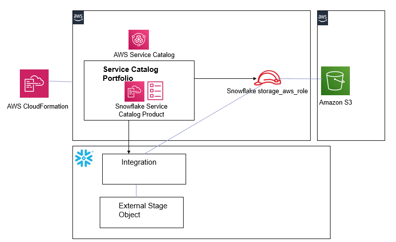

<p align="center">
</p>

# Use AWS Service Catalog to automate Snowflake storage integration to access Amazon S3

1. Snowflake storage integrations are Snowflake objects that allow Snowflake to read and write data to Amazon S3. Snowflake storage integrations leverage AWS IAM to access S3. The S3 bucket is referenced by the Snowflake integration from an external (i.e. S3) Snowflake stage object
2. This solution provides full automation for Snowflake to access S3 using AWS Service Catalog. The solution implements an AWS Service Catalog product that automates Snowflake access to S3.
	1. The Service Catalog product provisions a Snowflake integration object, attaches an IAM role to it and creates a Snowflake stage for it that references S3. 


## How it Works

1. Provisions a Service Catalog Portfolio with a Service Catalog Product
2. The Snowflake Service Catalog Product takes a) Snowflake Connection information and b) S3 bucketname and prefix as input parameters and uses the *aws-snowflake-integrationobject.yml* CloudFormation template to create a Snowflake external stage object that enables access to S3.
	1. The Snowflake Service Catalog Product can be invoked as many times as needed. Each time it creates a Snowflake external stage object to access an S3 object/prefix based on the 2 input parameters (a and b) supplied above.
3. The template from 2:
	1. Provisions AWS Secrets Manager to store and retrieve Snowflake connection information
	2. Provisions a Lambda function that uses the Snowflake python connector:
		1. Creates a Snowflake integration object and obtains the Snowflake generated *AWS_IAM_USER_ARN* and *AWS_EXTERNAL_ID* from the Snowflake integration 
		2. Provisions an AWS IAM role that uses the Snowflake generated IAM Principal and External ID from 1 above
		3. Creates a Snowflake stage object that leverages the snowflake integration
	
 
## Solution Design




## Prerequisites

1. Create an S3 bucket: ***s3-snowflakeintegration-accountId-region***. Replace accountId and region with the AWS Account ID and region of your AWS account. 
	1. Upload the [snowflakelayer.zip](https://github.com/Snowflake-Labs/aws-integrations-cloudops/blob/master/layer/snowflakelayer.zip) in the root folder of this S3 object. This zip file packages the Snowflake connector as an AWS Lambda layer
	2. Create a folder called *template* and upload the [aws-snowflake-integrationobject.yml](https://github.com/Snowflake-Labs/aws-integrations-cloudops/blob/master/cft/aws-snowflake-integrationobject.yml) CloudFormation template. This template is provisioned when the Service Catalog Product is launched and it automates this integration for Snowflake to access S3
2. Create a Snowflake user and role with the ability to create Integraitons in your Snowflake account. Below are sample SQL Commands that can be used.
```use role accountadmin;
create or replace role store_rl;
grant role store_rl to role sysadmin;
grant create integration on account to role store_rl;

CREATE OR REPLACE USER store_admin PASSWORD = '<password>' 
            LOGIN_NAME = 'store_admin' 
            DISPLAY_NAME = 'store_admin' 
            DEFAULT_ROLE = "store_rl" 
            MUST_CHANGE_PASSWORD = FALSE;
GRANT ROLE store_rl TO USER store_admin;
```
3. Option - Have an AWS User Group with privliges to create an IAM Role, Create and access AWS Secrets, Create Lambda Functions/Layer, Relevant S3 bucket access and KMS Key creation  

## How to Install

**1-step install**
1. Launch the [aws-snowflakeintobj-servicecatalog](https://github.com/aws-samples/aws-datadog-controltower/blob/main/snowflake/cft/aws-snowflakeintobj-servicecatalog.yml) template. The template takes the S3 prerequisites bucket as a single parameter.
 	
## Test and Run

1. The Snowflake solution creates a Snowflake Service Catalog Portfolio, a ‘SnowflakeEnduserGroup’ AWS IAM group and provides this IAM group with access to the Portfolio. In order to launch the Snowflake Service Catalog Product, you have 2 options – 
	1. Option 1 - Grant your current logged in AWS IAM user/role permissions to access the Snowflake Service Catalog Portfolio by following steps [here](https://docs.aws.amazon.com/servicecatalog/latest/adminguide/getstarted-deploy.html) and launch the Snowflake Service Catalog product using your current logged in IAM user/role.
	2. Option 2 – Add an IAM user to the ‘SnowflakeEnduserGroup’ IAM group. Log in as this IAM user to launch the Snowflake Service Catalog Product
2. Make sure the user that accesses Service Catalog also has access to the User Group or Privilges outlined in the Prerequisites Step 3
3. Navigate to the Service Catalog Console and launch the Snowflake Service Catalog Product.
	1. Provide Snowflake connection details (note that the Snowflake Account ID is the [Account Identifier](https://docs.snowflake.com/en/user-guide/admin-account-identifier.html)), the name of the Storage Integraiton in Snowflake, the S3 bucket created in the prerequisites with the code and the S3 bucket name for the data bucket 
5. From your Snowflake account (snowsql or console)-
	1. Validate that a new Snowflake integration object has been created - the name of the integration object will be the input paramater in the step above and *_STORAGE_INTEGRATION* apended to it (DESC INTEGRATION *'integrationobjectname'*)
	2. Obtain the *AWS_IAM_USER_ARN* and *AWS_EXTERNAL_ID* parameters from above and check that the AWS IAM role uses those as the trust relationship and external id parameters
	3. Validate that a new storage object has been created in Snowflake that references the S3 bucket
	4. You can now create [Snowflake Stages](https://docs.snowflake.com/en/sql-reference/sql/create-stage.html) to various folders in the bucket and assign priviliges to other roles in Snowflake to read & write data to S3
## Cleanup

To clean up your account after deploying the solution perform the following steps:

1.	Terminate the Snowflake Service Catalog Provisioned Product. Follow steps [here](https://docs.aws.amazon.com/servicecatalog/latest/userguide/enduser-delete.html) to terminate Service Catalog provisioned products
2.	If you followed Step 1a (Option 1) in the Test and Run section then remove the access of your logged in AWS user from the Snowflake Service Catalog Portfolio. If you followed Step 1b (Option 2) in the Test and Run section, then remove the IAM user from the ‘SnowflakeEnduserGroup’ IAM group
3.	Delete the CloudFormation stack for the [aws-snowflakeintobj-servicecatalog](https://github.com/aws-samples/aws-datadog-controltower/blob/main/snowflake/cft/aws-snowflakeintobj-servicecatalog.yml) template


 
