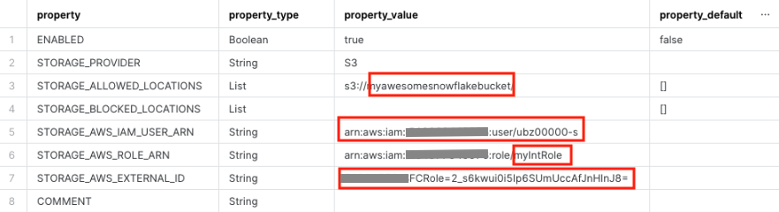
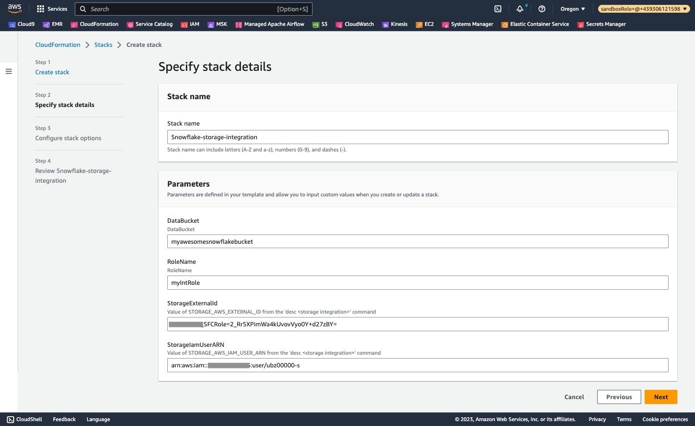
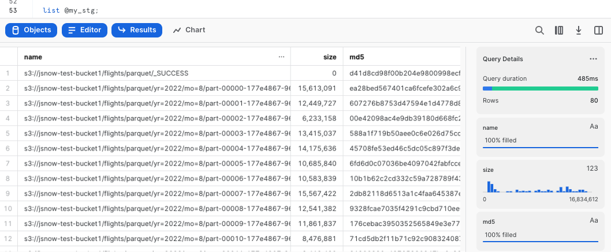

<p align="center">
</p>

# Use a AWS Cloudformation template to automate Snowflake storage integration to access Amazon S3

1. Snowflake storage integrations are Snowflake objects that allow Snowflake to read and write data to Amazon S3. Snowflake storage integrations leverage AWS IAM to access S3. The S3 bucket is referenced by the Snowflake integration from an external (i.e. S3) Snowflake stage object
2. This solution provides automation for Snowflake to access a S3 bucket by deploying a Cloudformation template. The template takes outputs from the 'desc integration' command from Snowflake and creates
an IAM role that can be assumed by Snowflake and has the permissions to access the S3 bucket.
3. Note this approach is for a single storage integration only, it is different from the [Service Catalog](https://github.com/sfc-gh-jsun/aws-integrations-cloudops) that should be used for multiple storage integrations with the Snowflake and AWS Account.


## How to use the template

1. Create a S3 bucket that you want to integrate with Snowflake if it doesn't exist
2. In your Snowflake UI, open a worksheet and run the following command to create a storage integration
```commandline
CREATE or replace STORAGE INTEGRATION <name of the integration>
  TYPE = EXTERNAL_STAGE
  STORAGE_PROVIDER = 'S3'
  STORAGE_AWS_ROLE_ARN = 'arn:aws:iam::<your AWS account ID>:role/<name of the IAM role>'
  ENABLED = TRUE
  STORAGE_ALLOWED_LOCATIONS = ('s3://<name of your S3 bucket>/');

  desc integration <name of the integration>;
```
For example:
```commandline
CREATE or replace STORAGE INTEGRATION myS3Integration
  TYPE = EXTERNAL_STAGE
  STORAGE_PROVIDER = 'S3'
  STORAGE_AWS_ROLE_ARN = 'arn:aws:iam::111222333444:role/myIntRole'
  ENABLED = TRUE
  STORAGE_ALLOWED_LOCATIONS = ('s3://myawesomesnowflakebucket/');

  desc integration myS3Integration;
```
You should see an output similar to the screen capture below:



You will need the information in the red boxes as the inputs for the Cloudformation template.

3. Now click [here](https://console.aws.amazon.com/cloudformation/home?region=us-west-2#/stacks/new?stackName=Snowflake-storage-integration&templateURL=https://jsnow-vhol-assets.s3.us-west-2.amazonaws.com/storageInt.json) to create the Cloudformation stack.
   Click `Next`, and you will see the page where you need to type in the values from the step above.



   Continue clicking through a couple of pages and
   leave everything as default, then submit the stack. In a few minutes, the stack is deployed.

4. Go back to the Snowflake UI and issue the follow command to create a stage:

For example
```commandline
create or replace stage my_stg storage_integration = myS3Integration
url = 's3://myawesomesnowflakebucket/'
file_format = (type = 'parquet');
```

Now list the external stage:
```
list @my_stg;
```

You should be able to see the content of the stage. For example:




   