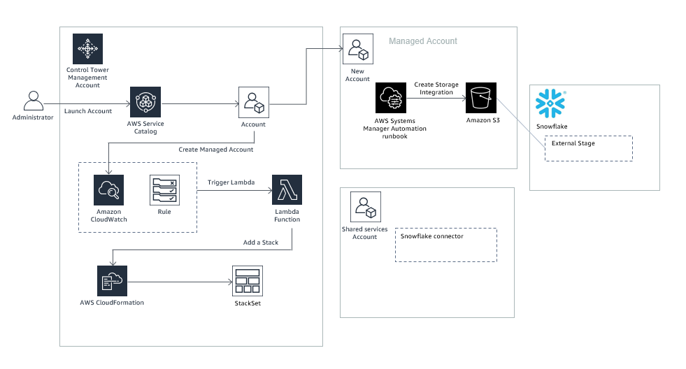

# Use AWS Control Tower to automate multi account Snowflake storage integrations in AWS

## Overview

1. Snowflake storage integrations are Snowflake objects that allow Snowflake to read and write data to Amazon S3. This Control Tower integration with Snowflake solution enables Snowflake storage integrations with Amazon S3 to be automatically available for all newly added AWS accounts in an AWS Control Tower environment.

3. Each time AWS Control Tower provisions a new account in AWS, the account is automatically setup with an AWS Systems Manager automation runbook for creating Snowflake storage integrations with S3 in that account. The administrator for the new AWS account launches the runbook to create Snowflake integrations with S3 buckets in that account. 

## How it Works

1. The solution is deployed using AWS CloudFormation templates and integrates with AWS Control Tower lifecycle events. When a new account is created or an existing one is enrolled using the AWS Control Tower Account Factory, the lifecycle event triggers a Lambda function. The Lambda function creates new CloudFormation stack instances in the newly added Control Tower managed account.
2. The stack instance in the newly added Control Tower managed account provisions an AWS Systems Manager Automation runbook in the managed account. The runbook is then launched by account administrators of this Control Tower managed account to create Snowflake integrations with S3 buckets in that account.
3. The AWS Systems Manager Automation runbook in the managed account automates all the steps required by Snowflake to create a storage integration with S3 in that account - it provisions a Snowflake integration object, attaches an IAM role to it, and creates a Snowflake stage object for it that references S3. 
	1. The runbook uses AWS Secrets Manager to store and retrieve Snowflake connection information. 
 
## Solution Design

## Setup

**Shared services account:**

1. Create an S3 bucket: *s3-snowflakeintegration-accountId-region*. Replace accountId and region with the AWS Account ID and region of your shared services AWS account. 
2. Create a folder called *SnowflakeIntegration_Lambda_SSM* and upload the [SnowflakeIntegration_Lambda_SSM.zip](https://github.com/Snowflake-Labs/aws-integrations-cloudops/blob/master/aws-controltower/lambda/SnowflakeIntegration_Lambda_SSM.zip) file. This lambda uses the Snowflake Python Connector to query and update Snowflake
3. Upload the [snowflakelayer.zip](https://github.com/aws-samples/aws-datadog-controltower/blob/main/snowflake/layer/snowflakelayer.zip) in the root folder of this S3 object. This zip file packages the Snowflake connector as an AWS Lambda layer
4. Provide organization level read access to this S3 bucket:
	1. Download the [s3bucketpolicy.json](https://github.com/Snowflake-Labs/aws-integrations-cloudops/blob/master/aws-controltower/cft/s3bucketpolicy.json) permissions policy file. Replace accountid and region with the AWS Account ID and region of your shared services AWS account. Sign in to your Control Tower organization's management account. Navigate to the AWS Organizations console and choose Settings. Note down the organization ID of your Control Tower organization and replace organizationid in the s3bucketpolicy.json file with this identifier. 
	2. Add the s3bucketpolicy.json as a bucket policy to your s3-snowflakeintegration-accountId-region S3 bucket from the AWS console.

	
**Control Tower Management account:**

1. Launch the [aws-snowflake-controltower.yaml](https://github.com/Snowflake-Labs/aws-integrations-cloudops/blob/master/aws-controltower/cft/aws-snowflake-controltower.yaml) template. The template takes connection information for your Snowflake account as parameters.
 	
## Test and Validate

**Control Tower Management account:**

1. Use Control Tower Account Factory to create a new managed account in your AWS Organizations. This can take up to 30 mins for the account to be successfully created and the AWS Control Tower Lifecycle Event to trigger the account creation event.

**Control Tower Managed account:**

1. Navigate to the AWS Systems Manager console in your AWS account. Select Documents from the left panel. Select Owned by me on the right panel and search for the ‘Custom-Snowflakestorageintegration’ document.
	1. Launch your Systems Manager document from the console. Provide Snowflake connection details and an S3 bucket name as parameters
2. Navigate to the AWS IAM console and check that a new IAM role has been provisioned that ends with *S3INTxxxxx* suffix. This suffix will also be the name of your new Snowflake integration object
3. From your Snowflake account (snowsql or console)-
	1. Validate that a new Snowflake integration object has been created (DESC INTEGRATION *'integrationobjectname'*)
	2. Obtain the *AWS_IAM_USER_ARN* and *AWS_EXTERNAL_ID* parameters from above and check that the AWS IAM role uses those as the trust relationship and external id parameters
	3. Validate that a new storage object has been created in Snowflake that references the S3 bucket and uses the integration object (SHOW STAGES IN ACCOUNT)

 
